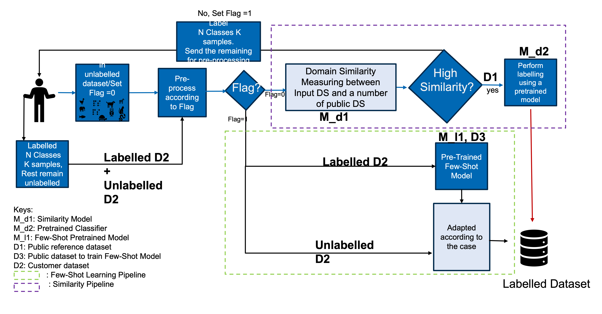

# AI Alliance – Efficient Labelling Service

[](https://www.python.org/)
[](https://streamlit.io/)

This repository contains the **Efficient Labelling Service** developed in the AI Alliance project.  
The framework provides:

- A **Graphical User Interface (GUI)** (built with Streamlit) for demonstration and exploration.
- A **Service** module containing the **Similarity Pipeline** and **Labelling Pipeline**, which can be used independently or in combination.
- A flexible architecture allowing you to use the full demonstrator, or integrate individual pipelines into your own workflow.



---

## Repository Structure

```
.
├── gui/                      # Streamlit GUI demonstrator
├── service/                  # Core pipelines and service logic
│   ├── similarity_component/ # Similarity pipeline
│   ├── labelling_component/  # Labelling pipeline
│   └── main.py               # Entry point for combined service
├── assets/                   # Showcase datasets and images
└── README.md                 # (this file)
```

---

## Quickstart

### 1. Clone the repository
```bash
git clone https://github.com/your-org/efficient-labelling-service.git
cd efficient-labelling-service
```

### 2. Install dependencies
```bash
pip install -r requirements.txt
```

### 3. Run the GUI
```bash
cd gui
streamlit run app.py
```

### 4. Use the pipelines directly
- [Similarity Pipeline](service/similarity_component/README.md)  
- [Labelling Pipeline](service/labelling_component/README.md)

---

## Docker Setup

Build and start the docker
```bash
docker compose up --build
docker compose up -d 
```

Terminate the docker
```bash
docker compose down 
```

---

## Notes
- The **datasets** and **model_weights** folders are excluded from this repository. Please request access from the AI Alliance team.
- The GUI comes with showcase datasets for demonstration (`/gui/assets/hannover_messe_data`).

---

## Contributing
Contributions are welcome! Please open an issue or submit a pull request.

## License
[MIT License](LICENSE)
